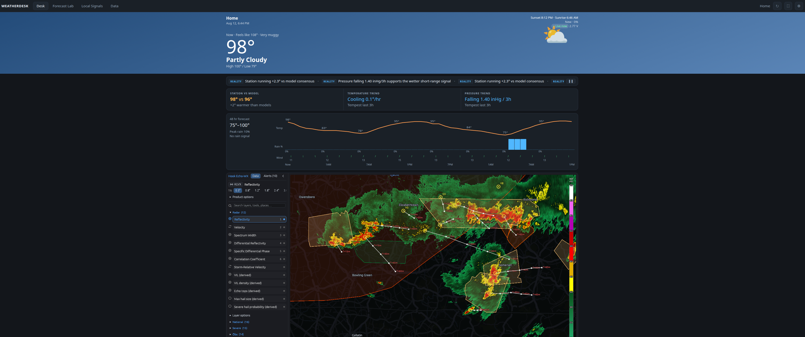

# WeatherDesk

A self-hosted weather dashboard for a WeatherFlow Tempest station, built for a wall tablet on the
LAN. Vanilla JS, native ES modules, no build step, no framework, no chart library, no backend —
every call goes browser-direct to a free public API.



## Sections

- **Desk** — every panel drags by its grip and resizes from its corner, with the arrangement kept
  in `localStorage`; sky-gradient hero (astro + moon phase + battery + live-observation age), signal ticker,
  station-vs-model trend strip, 48h temp/rain/wind chart, inline radar, six day cards with
  temperature arcs, eight dial gauges, 10-day list, alert center, weather story, model agreement,
  forecast changes, forecast accuracy, air quality.
- **Forecast Lab** — radar, embedded from [Hook Echo-WX](https://hookecho.netlify.app/).
- **Local Signals** — nearby-station comparison table and the Tempest websocket live wind feed.
- **Data** — nine boards off 7-day device history, multi-model output and the local verification log.

## Moving things around

Hover any panel for its grip in the top-right corner. Drag the grip to reorder within its row or
column, drag the panel's bottom-right corner to resize, and double-click the grip to restore that
one panel. Settings → **Reset panel layout** puts everything back.

## Data sources

| Feature | Endpoint |
|---|---|
| Station meta, observations, forecast | `swd.weatherflow.com/swd/rest/` |
| Live 3-second wind, lightning strikes | `wss://ws.weatherflow.com/swd/data` |
| Watches and warnings, gridpoint forecast | `api.weather.gov` |
| Multi-model agreement, 15-minute nowcast, AQI | `api.open-meteo.com` |
| Radar | Hook Echo-WX |
| Place search | `photon.komoot.io` |

## Running it

```sh
git clone https://github.com/d4vid87/weatherdesk
cd weatherdesk
python3 -m http.server 8088 --bind 0.0.0.0
```

Open `http://<box>:8088`, then paste a WeatherFlow personal access token
(tempestwx.com → Settings → Data Authorizations) and a station ID into the settings drawer. The
station lookup fills in the name, coordinates and numeric device ID. Everything else — units,
refresh interval, saved places, notification categories, forecast snapshots and the verification
log — lives in `localStorage`; there is nothing to configure on the server.

For a permanent install, a systemd user unit running that same command is enough.

## License

MIT. See [LICENSE](LICENSE).

## Notes

No service worker and no PWA install: the app is useless offline because every source is a cloud
API, and the LAN origin is insecure anyway, so the Notification API is unavailable. Alerts render
as an in-page banner queue with a WebAudio chime instead.

The layout follows the shape of myweatherdesk.com. No code was taken from it; this is written from
scratch against the same public APIs.
