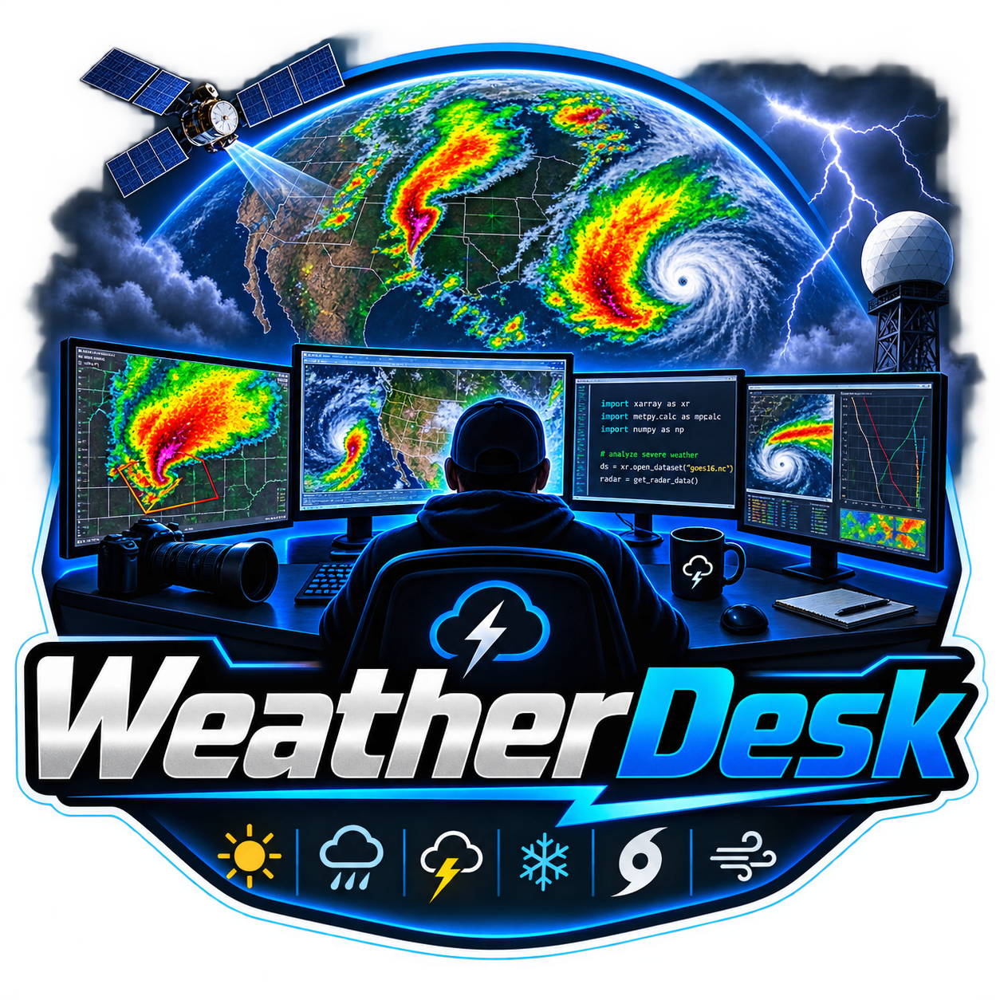

<p align="center"></p>

# WeatherDesk

A self-hosted weather dashboard for your own weather station, built for a wall tablet on the LAN.
WeatherFlow Tempest, Ecowitt, Ambient Weather, Davis, AcuRite, La Crosse and any Weather
Underground-protocol console all work; with no station at all it runs on a forecast for a place you
name. Vanilla JS, native ES modules, no build step, no framework, no chart library, no backend —
every call goes browser-direct to a free public API.

Radar comes from [HookEcho](https://hookecho.io/) — my own NEXRAD viewer,
embedded here and centered on the station.


## Sections

- **Desk** — every panel drags by its grip and resizes from its corner, with the arrangement kept
  in `localStorage`; sky-gradient hero (astro + moon phase + battery + live-observation age), signal ticker,
  station-vs-model trend strip, 48h temp/rain/wind chart, inline radar, six day cards with
  temperature arcs, eight dial gauges, 10-day list, alert center, weather story, model agreement,
  forecast changes, forecast accuracy, air quality, sun & moon detail (golden hour, day-length
  change, moonrise/set), fire weather & dryness, and station health (battery, signal, sensor
  faults, time since the last report).
- **Forecast Lab** — radar, embedded from [HookEcho](https://hookecho.io/).

The Desk radar loads itself, in HookEcho's embedded mode: no chrome, and one frame a minute until
you touch it. That matters because a live radar loop repaints ten times a second, and the WebKit
webview the desktop app uses on Linux and macOS redraws the whole Desk on every one of those
frames — enough to saturate a CPU core. Touch the map and it animates normally; the Forecast Lab
tab is the full-chrome view.

It is also the heaviest thing on the page — megabytes of wasm, sharing one WebKit process with the
whole Desk on Linux — so it never loads during startup or while Settings is open, and only once the
panel is actually on screen. On a fresh install it starts switched off; Settings → **Radar panel on
the Desk** turns it on. On a slow machine, leave it off and use the Forecast Lab tab instead.

Settings → **Radar site** picks which radar, out of all 201 WSR-88D and TDWR sites, nearest first;
leave it on *Nearest to my station* and it follows the station. Wherever you leave the map — site,
product, tilt, basemap, zoom — is remembered here and handed back to the viewer on the next launch.
It has to work that way round: browsers partition an iframe's storage, so the embedded viewer
cannot remember anything on its own. The Desk and the Lab share one remembered view.

**Is the radar live?** It is as live as NEXRAD gets: a WSR-88D takes 4–10 minutes to finish a
volume scan, and delivery adds a little more, so the newest frame is always a few minutes behind
the sky. Nothing on the internet is fresher — that delay is the radar itself, not the viewer.
- **Local Signals** — nearby-sensor comparison table, the Tempest live wind feed, a 24-hour
  lightning-strike log and the notification history. Set a **nearby sensor radius** in Settings
  and the airports (NWS/METAR) inside it are added on their own, with the same table on the Desk
  as a *Nearby sensors* panel. Other people's Tempest stations can't be read unless they are
  shared publicly, so those are still added by ID (or by pasting their tempestwx.com link).
- **Data** — ten boards off 7-day device history, including a wind rose, plus multi-model output
  and the local verification log, a garden card (growing degree days, evaporation, watering
  shortfall), the almanac (all-time records, this day last year, rain month by month with last
  year dashed over it), and an archive explorer: pick any two dates and any column and get the
  chart, the range and the total.

Three more Desk cards appear only when they have something to say, and hide themselves again
afterwards: the **severe outlook** (SPC categorical risk for your exact point, with the day's peak
CAPE and the cap holding it down), **snowfall** for the week, and the **tropics** when there is a
named storm in the Atlantic or the eastern Pacific.

Every chart has a crosshair — hover, or touch on a tablet, for the value and the time at the
nearest real sample. The hero says how today compares with the 1991–2020 normal for the date.

## Quiet hours, speech and the panel catalog

`Settings → Quiet hours` silences the chime and every push channel between two times — Severe and
Extreme warnings still come through, because that is what the setting is for. On a kiosk, **Read
severe alerts aloud** speaks them. On the desktop, an alert raised while the window is hidden
becomes a real OS notification.

`Settings → Panel catalog` moves any Desk panel to the Data or Local Signals tab; it keeps working
where it lands. `Settings → Palette` adds OLED black, Solarized, high contrast and a flat e-ink
mode on top of the light and dark themes.

`Settings → LAN dashboard port` moves the server off 8088 (restart to apply); the window title
always shows the address a tablet should open.

## Alert rules and push

Settings → **Alert rules** builds thresholds on live readings: a metric (temperature, dew point,
gust, wind, humidity, rain rate, UV, 3h lightning count, 3h pressure change), above or below, a
value, and how long it has to hold. **+ AND** adds a second condition and then both have to hold —
"gust above 25 AND humidity below 40" is a fire day; either half alone is a Tuesday. A rule fires
once and re-arms when the reading falls back through 90% of its threshold, so a gust hovering on
the line does not notify all afternoon.

Any alert can leave the machine:

- **ntfy** — put a topic in Settings and install the ntfy app on your phone. The topic is the
  whole of the security on ntfy.sh, so make it long and unguessable, or run your own server and
  point the ntfy server field at it.
- **Webhook** — a POST of `{title, body, category, t}` to any URL. Discord and Telegram webhook
  URLs are recognised from the URL itself and sent in the shape those two accept, so pasting one
  in is the whole setup.
- **MQTT** — every alert is also published to `weatherdesk/<station>/alert` when a broker is
  configured.

None of these ever carry your Tempest token, station ID or broker password — title, body and
category only.

## Eco mode and pacing

Settings → **Eco mode** halves how often everything polls, stops the ticker and drops the seconds
from the clock. On *Auto* it turns itself on when the browser reports four cores or fewer, which
covers the tablets and old laptops this is often left running on. Overnight (sunset+1h to
sunrise−1h) everything slows further on its own, and an active Severe or Extreme NWS alert puts
the whole dashboard back to full speed — and brings the radar panel up if it was hidden.

A panel that has stopped updating keeps its last good numbers and marks itself with its age in the
corner, rather than blanking or lying. The forecast and current observations are cached, so a
reload during an outage still renders something.

## Moving things around

The Desk is one 12-column grid and every panel is a free agent. Drag a panel by the grip in its
top-right corner to drop it anywhere in the grid; drag its right edge to change how many columns it
spans, its bottom edge for height, the corner for both. Double-click the grip to restore one panel,
or Settings → **Reset panel layout** to put everything back.

Name an arrangement in Settings → **Save layout** to keep it, and load it back from the list below
— one layout for the wall tablet, another for the desktop window. The padlock in the header hides
every grip and handle, so a mounted tablet can't be rearranged by a passing sleeve.

Both gestures are pointer events, so they work the same with a mouse, a pen or a finger — the
tablet case is the one that matters, and HTML5 drag-and-drop never fires for touch.

On a phone-sized screen — the Android app on a handset, or a phone browser — the grips are off
until you ask for them: left on, they sit over the panel titles and swallow taps meant for the
panel underneath. Settings → **Rearrange panels** turns them on, and the button turns them off
again. Moving and hiding work there; resizing does not, because a phone gives every panel the full
width and its natural height anyway. That mode is per-device and lasts until the app is closed —
the layout it writes is the shared one, so a panel moved on the phone moves on the wall tablet too.

## Data sources

| Feature | Endpoint |
|---|---|
| Station meta, observations, forecast | `swd.weatherflow.com/swd/rest/` |
| Live 3-second wind, lightning strikes | `wss://ws.weatherflow.com/swd/data` |
| The same, straight off the hub's LAN broadcast (desktop app only) | UDP `50222` |
| Watches and warnings, gridpoint forecast | `api.weather.gov` |
| Multi-model agreement, 15-minute nowcast, AQI | `api.open-meteo.com` |
| Radar | [HookEcho](https://hookecho.io/) at `hookecho.pages.dev` |
| Place search | `photon.komoot.io` |
| Other brands of station (see below) | your own LAN, `rt.ambientweather.net` |

## Other weather stations

WeatherDesk was written around a Tempest, but the Tempest tuple is only the internal format — the
desktop app can take a report from most other consumer stations, convert it once on the way in and
drive the whole dashboard from it. Everything downstream (archive, charts, CSV export, MQTT, alert
rules, CWOP) works the same, and the forecast comes from open-meteo instead of WeatherFlow.

Pick your brand under Settings → **Another brand of station**, and set the station's latitude and
longitude (the first-run wizard's "Not a Tempest?" section does both at once).

**Ecowitt — Wittboy, GW1100 / GW1200 / GW2000 / GW3000.** WSView Plus → your gateway → *Customized*
upload. Protocol **Ecowitt**, server the app's IP, path `/ingest`, port `8088`, interval 16 s or
slower. Nothing else to fill in here.

**Ambient Weather — WS-2902 / WS-2000 / WS-5000 / WS-1550-IP.** Console firmware 4.2.8 or newer,
then the awnet app → *Custom server*, same address and path. Ambient's consoles speak their own
query-string format; the server recognises it.

**Weather Underground protocol.** Many other consoles can only be told a WU server — Vevor,
Sainlogic, Fine Offset and most of the rest. Point them at the app's IP and port and leave the path
alone; every spelling those firmwares use is answered (`/weatherstation/updateweatherstation.php`,
the bare `/updateweatherstation.php`, `/data/report`), with the `success` body they look for. Two
things catch people out: the console must be allowed plain **HTTP**, not HTTPS, and it must accept
a port other than 80. Firmware that insists on either needs a router rule forwarding port 80 to
8088 on this machine.

**WeeWX.** WeeWX already speaks the WU protocol, so it needs no plugin — in `weewx.conf`, under
`[StdRESTful] [[Wunderground]]`, set `server_url = http://<host>:8088/ingest`, any `station` and
`password`, and `enable = true`. Pick *Weather Underground protocol* as the brand here. That also
covers every driver WeeWX has, which is most hardware that exists (issue #47).

**Davis — Vantage Pro2, Vantage Pro2 Plus, Vantage Vue.** Needs a WeatherLink Live (or a Console
6313) on the network. Put its IP in *WeatherLink Live address*; the app polls its local API every
ten seconds. No cloud, no key.

**KestrelMet 6000, or any Ambient console you would rather leave on Ambient's servers.** Both keys
from ambientweather.net → *My devices* → API keys, into *AWN API key* and *AWN application key*.
Polled once a minute.

**AcuRite Iris (5-in-1).** AcuRite publish no API, local or otherwise. What works is listening to
the sensor directly with an RTL-SDR dongle and piping the result in:

```sh
rtl_433 -C si -F json | while read -r line; do
  curl -s -XPOST -H 'Content-Type: application/json' --data "$line" http://<host>:8088/ingest
done
```

Anything `rtl_433` decodes lands the same way, so this is also the escape hatch for a station no
other section covers.

**On the phone app.** The Android build is a dashboard, not a server: it has no address a console
can upload to. Cloud sources (*Ambient Weather Network*, *La Crosse*) work there directly; for a
push brand, run the desktop build or the Docker image on a machine that stays on and point the
phone at that address.

**La Crosse Technology (C85845 and friends).** Account email and password. This one is unofficial —
it reads the API their own app uses, and it can stop working without notice. Those readings are
tagged separately in the archive so they can be deleted on their own if it ever goes wrong.

Notes that apply to all of them:

- **One station per install.** The archive keys on the timestamp with no room for a second
  station; two consoles pointed at one app would interleave.
- **Rain and lightning** arrive as running daily totals and are stored as per-interval amounts.
  A restart forfeits one interval — a minute of rain, once.
- **Ingest key.** Leave it blank on a network you trust (the same trust model as `/config`, below).
  Set it and the console has to report to `/ingest/<key>` instead.
- **Battery and sensor health** stay blank: every other brand reports a flag rather than a voltage,
  and the health card's thresholds are a Tempest's.

## Smart home

WeatherDesk publishes your station to Home Assistant over MQTT, evaluates your alert rules
server-side, and reads Home Assistant entities back onto the dashboard. **Full guide:
[docs/homeassistant.md](docs/homeassistant.md).** The short version:

**Publishing.** Settings → **Home Assistant** → point *MQTT broker* at `mqtt://host:1883`
(`mqtts://` for TLS) and press **Test both** — it connects for real and waits for the broker to
acknowledge a message, because a broker that rejects your password accepts the TCP connection
first. Home Assistant then discovers one device with fifteen sensors under it, plus `feels_like`,
`pressure_trend` as a word, `alert` and `rule`. Nothing to add to `configuration.yaml`.

Readings are retained on `weatherdesk/<station id>/…`, **in SI units** (°C, m/s, hPa, mm) whatever
the dashboard displays — a units switch here must never rewrite months of Home Assistant history.
`weatherdesk/<station id>/status` is `online`/`offline`, the second written by the broker's
last will.

The server does this, not the page, so it keeps working with every window closed. Leave the
desktop app or the container running; that is the always-on copy.

> Upgrading from before 3.2.0? Publishing used to run in the browser over a WebSocket. Change the
> address from `ws://host:9001` to `mqtt://host:1883` — the app says so if you leave the old one
> there — and you can drop `protocol websockets` from mosquitto if nothing else used it.

**Alerts.** Your alert rules are evaluated by the server too, against the same thresholds, hold
times and re-arm behaviour the dashboard uses, and pushed through ntfy, a webhook and the broker.
Severe weather comes off the National Weather Service the same way. A tablet that sleeps at
midnight used to be a house with no frost warning. **Test push channels** sends one real
notification down every configured channel.

**Reading back.** Paste a Home Assistant URL and a long-lived access token, press **List
entities**, and tick what you want on the Desk. The list is fetched by the server, so the token
never reaches a browser and **you no longer need `cors_allowed_origins`** — the request is
same-origin. Read-only, deliberately: switching things is Home Assistant's job.

Broker topics can be read back too — Settings → **Broker topics to show** (`topic | label | unit`,
one per line), for sensors that never went near Home Assistant, like a greenhouse probe publishing
straight to mosquitto.

**Blueprints.** Three importable automations in
[`blueprints/automation/weatherdesk`](blueprints/automation/weatherdesk): a severe alert to a
critical push, a gust threshold to any action, and skip-irrigation-after-rain.

**HomeKit, Alexa, Google.** Through Home Assistant, which already bridges all three — there is no
WeatherDesk-specific code for them and there shouldn't be. Add the MQTT integration (the device
above appears), then Settings → Devices & Services → Add Integration → **HomeKit Bridge** and pick
it; Alexa and Google go through Home Assistant Cloud or their own manual setups.

## Quick start

1. **Token** — tempestwx.com → Settings → **Data Authorizations** → *Create Token*. Any personal
   use token works; paste it into Settings → *Tempest API token*.
2. **Station ID** — the number in your station's URL, `tempestwx.com/station/NNNNN`. That number,
   not the station name and not the serial on the sensor.
3. **Device ID** — leave it blank. The station lookup fills it in. (A station ID pasted here is
   numeric too, and used to break every history chart in silence; the app now corrects it and says
   so.)

Everything is saved in the browser's `localStorage`, per install — the desktop app and a browser
tab don't share settings.

## Download & run

Grab the installer for your OS from [Releases](https://github.com/d4vid87/weatherdesk/releases) and
double-click it. What changed in each version is in [CHANGELOG.md](CHANGELOG.md). The app opens in its own window *and* serves the same dashboard to the rest of your
network on port 8088 — the wall tablet just opens the URL shown in the window title. Nothing else to
install; leave the app running.

**One config for the whole house.** The desktop app also keeps your settings and dashboard layout
on the host computer. Any browser that opens the LAN URL loads that configuration — no re-typing the
token, no re-arranging panels per device — and a save from any of those browsers writes back, so the
next device to load picks it up. Open sessions don't update live; reload to fetch. Note that this
means anyone on your network can read the Tempest token from the host. Self-hosting the `site/`
folder statically has no config server, so those browsers keep their own settings as before.

The app also listens for your hub's UDP broadcasts on port 50222 and re-serves them to the tablet,
so live wind and lightning keep flowing with the internet unplugged. A browser can't hold a UDP
socket, so the no-install option below uses the cloud websocket only. If another Tempest app owns
port 50222 first, WeatherDesk skips it and falls back to the websocket by itself.

**UDP-only mode — no token at all.** On the desktop app, with your hub on the same network, leave
the token and station ID empty and the hub's own broadcasts still drive the hero, the wind, rain,
humidity, pressure, dew point and UV gauges, the live wind feed and the lightning log — and MQTT
publishing, if you use it. What needs the (free) token is everything that isn't your sensor:
forecasts, the 10-day list, history charts, model agreement, alerts. The pressure gauge reads
*station pressure* in this mode rather than sea-level pressure, because that is what the hub sends.

- **Windows** — run the `.msi`. The app is unsigned, so SmartScreen shows a warning: **More info →
  Run anyway**. Allow the Windows Firewall prompt on first launch, or the tablet can't connect.
  Defender occasionally quarantines a new unsigned installer outright — a false positive, reported
  to Microsoft for each release. Windows Security → Protection history → the item → **Restore**,
  then **Allow on device**. Every release ships a `SHA256SUMS.txt` to check the download against
  first: `certutil -hashfile WeatherDesk_*.msi SHA256`.
- **macOS** — open the `.dmg`, drag WeatherDesk to Applications. Unsigned, so on first launch macOS
  refuses it: **System Settings → Privacy & Security → Open Anyway**, or in a terminal
  `xattr -dr com.apple.quarantine /Applications/WeatherDesk.app`.
- **Linux** — `sudo apt install ./WeatherDesk_*_amd64.deb` (Debian, Ubuntu, Mint, Pop!_OS). On other
  distributions install `webkit2gtk-4.1` and build from source, below — there is no AppImage: it has
  to carry its own WebKitGTK, and that copy crashes on hosts newer than the machine that built it.
- **Raspberry Pi** — `sudo apt install ./WeatherDesk_*_arm64.deb` on 64-bit Raspberry Pi OS
  (Bookworm or newer, Pi 4 / Pi 5). `uname -m` must say `aarch64`; the 32-bit image is not built.

To start it automatically: macOS System Settings → General → Login Items; Windows put a shortcut in
`shell:startup`; Linux and Raspberry Pi OS add a `.desktop` file to `~/.config/autostart`:

```ini
[Desktop Entry]
Type=Application
Name=WeatherDesk
Exec=weatherdesk
```

A Pi with a screen attached is the whole appliance: it shows the dashboard itself *and* serves it to
any other tablet in the house. A Pi with no screen has no desktop for the window to open on — use
the server-only option below, which gives up the hub's UDP feed but nothing else.

## No-install / development option

```sh
git clone https://github.com/d4vid87/weatherdesk
cd weatherdesk
python3 -m http.server 8088 --bind 0.0.0.0 --directory site
```

Open `http://<box>:8088`, then paste a WeatherFlow personal access token
(tempestwx.com → Settings → Data Authorizations) and a station ID into the settings drawer. The
station lookup fills in the name, coordinates and numeric device ID. Everything else — units,
refresh interval, saved places, notification categories, forecast snapshots and the verification
log — lives in `localStorage`; there is nothing to configure on the server.

### Headless / home lab

No screen, no desktop session — just serve `site/` and open it from anywhere. Drop this in
`~/.config/systemd/user/weatherdesk.service`:

```ini
[Unit]
Description=WeatherDesk (static site)
After=network-online.target

[Service]
ExecStart=/usr/bin/python3 -m http.server 8088 --bind 0.0.0.0 --directory %h/weatherdesk/site
Restart=on-failure

[Install]
WantedBy=default.target
```

```sh
loginctl enable-linger "$USER"          # keeps it running with nobody logged in
systemctl --user daemon-reload
systemctl --user enable --now weatherdesk
```

There is no hub UDP feed in this mode — a browser can't hold a UDP socket, so every client rides
WeatherFlow's websocket, which means it needs a token and the internet. The desktop app is the only
build that listens on 50222.

The desktop app serves from its own origin, so settings saved in a browser install (token included)
don't carry over — paste the token once more in the app.

**Android / Fire tablets.** `WeatherDesk.apk` is on the same Releases page. Sideload it — the
tablet will ask you to allow installs from whatever app you downloaded it with (on Fire OS:
Settings → Security & Privacy → Apps from Unknown Sources). One APK covers 64-bit and 32-bit
devices, Fire OS 6 and newer. The phone build talks to WeatherFlow's websocket only: it neither
listens for the hub's LAN broadcasts nor serves the dashboard to other devices, both of which stay
desktop jobs. Paste the token once per device.

**The observation archive.** The desktop app keeps every observation the hub broadcasts in a
SQLite database at `<app data>/weatherdesk.db`. On first run of v3 it imports the v2 JSONL log and
then leaves those files alone forever as a backup.

About thirty seconds after start it also **backfills from WeatherFlow**: it walks backwards from
the oldest observation it holds, four days at a time, one request a second, until the station's own
history runs out. A station that has been up for years gets years of records on the first evening,
and the almanac says how much it has and whether it is still fetching. The walk is resumable — kill
the app halfway and it picks up from where it stopped.

`Settings → History CSV` hands the whole archive over as a spreadsheet, and `Backup archive`
downloads a consistent snapshot of the database itself. To restore one: quit the app, copy the file
over `<app data>/weatherdesk.db` (delete the `-wal` and `-shm` files beside it if they exist), and
start it again.

**CWOP.** Put a callsign in `Settings → CWOP station ID` and the app reports your readings to the
Citizen Weather Observer Program every ten minutes, where NOAA's MADIS feeds them to the models
this dashboard reads back out. Callsigns are public by design, so this one is not treated as a
secret.

**Live updates.** Every screen in the house holds one `/events` stream, so a gust shows up the
second the hub broadcasts it rather than on the next poll, and a setting changed on one screen
reaches the others without a reload. A browser that can't reach the stream falls back to polling
exactly as before.

**Updates.** `Settings → Check for updates` downloads and installs a signed release in place on
Windows, macOS and Linux packages. The version you are running is printed beside that button.
Flatpak installs update through Flatpak, and Android stays a sideload. Builds older than the
updater have to be reinstalled once from the releases page; settings and history survive.

**Re-uploading to Weather Underground or PWSWeather.** Most consoles hold one upload address, so
pointing yours at WeatherDesk takes it off whichever network it was on. Put the station ID and key
for either service under `Settings → This computer` and the app re-sends each reading once a
minute.

**Panels.** The × beside a panel's grip hides it; `Settings → Hidden panels` lists what is hidden
and puts it back. `Reset panel layout` restores everything at once.

### Docker / no desktop at all

The same binary runs with no window and no Tauri in it:

```sh
docker run -d --name weatherdesk --restart unless-stopped \
  --network host -v "$PWD/data:/data" ghcr.io/d4vid87/weatherdesk:latest
```

or the `docker-compose.yml` in this repo. Then open `http://<host>:8088`.

**`--network host` is not optional on Linux.** The Tempest hub broadcasts to the subnet, and a
broadcast does not cross a bridged Docker network no matter how many ports you publish — without
host networking the container serves the dashboard but never hears the hub.

**Home Assistant users upgrading from 3.1.x:** publishing moved from the browser into the server,
so the broker address changes from `ws://host:9001` to `mqtt://host:1883`. The app says so if you
leave the old one there. See [docs/homeassistant.md](docs/homeassistant.md).

**Upgrading from 3.0.9 or older takes one `chown`.** The container runs as uid 1000 now instead of
root, and a `./data` directory left by an earlier image is owned by root. The server does not
complain about that — it starts, serves the dashboard and stores nothing. Once, before you pull:

```sh
sudo chown -R 1000:1000 ./data
```

Everything lands in `/data`: `config.json` and `weatherdesk.db`. The image is built with
`--no-default-features`, so there is no GTK, no WebKit and no Tauri anywhere in it.

A local build of the same thing: `cargo build --release --no-default-features` in `src-tauri/`,
then run `weatherdesk --headless`.

### Flatpak and AUR

`flatpak/io.github.davidmay87.weatherdesk.yml` builds the Flathub package (regenerate
`cargo-sources.json` with flatpak-builder-tools whenever `Cargo.lock` changes), and `PKGBUILD`
builds the Arch package from a release tarball. A Flatpak install keeps its data under
`~/.var/app/io.github.davidmay87.weatherdesk/` — copy `weatherdesk.db` across if you are moving
from a .deb.

Building the desktop app yourself: `cargo tauri build` in `src-tauri/` (Rust + the Tauri
[prerequisites](https://tauri.app/start/prerequisites/) for your OS). Iterate on the HTML/JS with
the python command above; the app embeds `site/` at compile time.

## Sharing a read-only dashboard

The desktop app serves `http://<host>:8088/public` — the same dashboard with the settings drawer
gone and a config the server strips every credential out of before sending. It is the URL to give
a family tablet, a guest, or a reverse proxy pointed at the outside world.

Note the trust model of the ordinary `/` dashboard: `GET /config` deliberately serves the whole
settings blob, token included, to anything on the LAN, because that is how a second browser in the
house sets itself up without being configured by hand. Anyone on your network can read your Tempest
token. `/public` is the address to hand out if that is not what you want, and the only one to put
behind a proxy.

## Installing on a phone

The dashboard ships a web manifest, so any phone browser pointed at the LAN URL can add it to the
home screen and run it full-screen.

Put it behind https and it also installs as a proper PWA: `site/sw.js` caches the shell — the page,
the modules, the icons — so the dashboard still draws when the wifi is down, with the last good
forecast and observation marked stale. The weather itself is never cached by the worker, and the
network wins whenever it answers, so an update can't be pinned by a stale cache. Over plain http
nothing registers, and behaviour is exactly what it was.

The simplest LAN https is Caddy with its own CA:

```
weather.home.arpa {
  tls internal
  reverse_proxy 127.0.0.1:8088
}
```

**That address is the whole dashboard, and `GET /config` serves the station token to anyone who
asks it** — put it in front of screens you trust, not the internet. What goes on the internet is
`/public` and nothing else (see the section above). On nginx, add `proxy_buffering off;` and a
long `proxy_read_timeout` or the `/events` stream dies after a minute.

With https there is also a **Browser notifications** checkbox in Settings: alerts become real
notifications while the tab is in the background. There is no push server, so the page has to be
open — for a phone that is asleep, use the ntfy channel.

## Other devices

- **Windows 10 / 11** — the `.msi` on the Releases page is the whole answer; it's a normal desktop
  app on both.
- **iPad, iPhone, Echo Show, any other browser-only screen** — there is no native app, and there
  won't be. Run the desktop app or the headless server on a machine that stays on, then point
  Safari (or the Show's Silk browser) at that LAN URL. The Echo Show's browser is untested.
- **Android TV boxes (onn, Shield, Fire TV)** — the APK installs, but the dashboard is built for
  touch and mouse: a D-pad remote can't reach the settings drawer or drag a panel. Plug in a USB or
  Bluetooth mouse, or use an air-mouse remote.
- **Every public Tempest on a map** — that's WeatherFlow's own [tempestwx.com/map](https://tempestwx.com/map),
  which is also where you find the IDs for the Local Signals comparison table.

## Troubleshooting

Settings → **Diagnostics** pings every source and prints ✓/✗ plus latency for each, along with the
viewport size. Start there — it separates "my token is wrong" from "NWS is down".

| What you see | What it means |
|---|---|
| *token rejected: create or check a personal use token…* | The token is wrong, expired, or was never created. tempestwx.com → Settings → Data Authorizations. |
| *Token works but has no access to station N* | The token is valid but belongs to a different account, or the station ID isn't yours. The ID is the number in your `tempestwx.com/station/NNNNN` URL. |
| *not found: check the station/device ID* | A real 404 — usually a station ID typo, or a serial number (`ST-00176465`) where a numeric ID belongs. |
| *Device ID corrected* | Something that wasn't one of this station's devices was in the Device ID box. Fixed automatically; leave that box blank. |
| *Forecast stale — showing cached copy* | The last good forecast is on screen with its age marked; the source is unreachable right now. |
| *network unreachable* / *timed out (15s)* | Wi-Fi, DNS or the API itself. Diagnostics will show whether it's one source or all of them. |
| A nearby station row shows an error | Only **public** stations can be read. Pick one from tempestwx.com/map. |

On Windows, if the tablet can't load the LAN URL, it's the firewall prompt that was dismissed on
first launch — allow WeatherDesk on private networks.

## License

MIT. See [LICENSE](LICENSE).

## Notes

The service worker caches the shell only, and only on a secure origin — the plain-http LAN origin
can't register one, and every weather source is a cloud API, so offline means "the page still
draws, with the last reading marked stale". Alerts render as an in-page banner queue with a
WebAudio chime; on https they can also raise browser notifications, and the desktop build raises
real OS ones through Tauri. All three only fire when the window is hidden.

Releasing: the desktop updater needs `TAURI_SIGNING_PRIVATE_KEY` and
`TAURI_SIGNING_PRIVATE_KEY_PASSWORD` in the repo secrets, matching the public key in
`src-tauri/tauri.conf.json`. Lose that private key and no installed copy will ever accept another
update.

The layout follows the shape of myweatherdesk.com. No code was taken from it; this is written from
scratch against the same public APIs.
